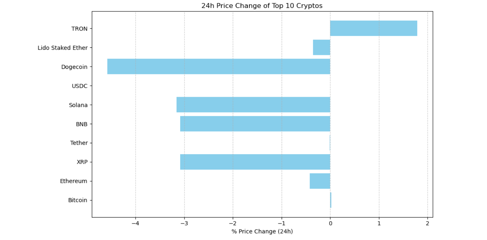

# 🪙 Crypto Price Monitoring Automation (Python + API)

This project automates the process of retrieving real-time cryptocurrency market data using the free CoinGecko API. It pulls the top 10 coins by market cap, cleans and structures the data using Python, saves it to Excel, and visualizes the 24-hour price changes — making it ideal for analysts, reporting, and dashboards.

---

## 📌 Project Objectives

- Pull live cryptocurrency data via the CoinGecko API
- Extract and clean relevant fields using `pandas`
- Save the data to an Excel file (`crypto_data.xlsx`)
- Visualize 24-hour percentage price changes using `matplotlib`
- Provide a base for future automation and Power BI dashboarding

---

## 🔧 Tech Stack

- Python 3.x  
- Jupyter Notebook  
- `requests` for API integration  
- `pandas` for data manipulation  
- `openpyxl` for Excel export  
- `matplotlib` for charting

---

## 📊 Features

- Automatically fetches top 10 cryptocurrencies by market cap
- Outputs key metrics: name, symbol, current price, market cap, volume, 24h price change
- Exports results to `crypto_data.xlsx`
- Displays a horizontal bar chart of 24h % change for quick analysis

---

## 📸 Sample Output

> 📈 *24-Hour Price Change Bar Chart*  
> 

---

## ▶️ How to Run

1. Clone or download this repository  
2. Open the Jupyter Notebook: `Crypto_Price_Monitoring_Automation.ipynb`  
3. Run all cells in order  
4. Data will be saved to `crypto_data.xlsx`  
5. The chart will display inside the notebook  

---

## 💡 Optional Enhancements

- Save daily data logs to a historical CSV
- Schedule auto-pulls using Task Scheduler or `cron`
- Connect Excel to Power BI for a live dashboard
- Add alert notifications for high % changes
- Expand to include more coins or timeframes

---

## 👨‍💻 Author

**Joshua Pratheek**  
_Data Analyst | Python | SQL | Excel | Power BI_  
🔗 [LinkedIn](https://www.linkedin.com/in/joshua-pratheek-aluri-261a8b305/) · 🌐 [GitHub](https://github.com/joshp568)

---

## 🏷️ Keywords

`python` · `cryptocurrency` · `api` · `data analysis` · `excel` · `matplotlib` · `automation` · `coingecko`

---

## 📜 License

This project is open source under the [MIT License](LICENSE).
